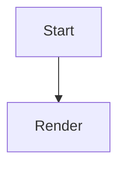

import LiveEditorExample from "../../../components/LiveEditorExample.svelte";
import { mermaidMarkdownFeature } from "../../../data/markdown-examples";

Mermaid support is packaged as an optional extension. The default UI enables it by default and includes rendered controls in live preview and reading mode.

<LiveEditorExample
  client:only="svelte"
  title="Mermaid"
  description="Preview a Mermaid diagram and inspect the rendered controls."
  initialValue={mermaidMarkdownFeature}
  height="34rem"
  sourcePath="markdown/mermaid.md"
/>

## Syntax

````md

````

`MiraDefaultMde` adds the Mermaid extension automatically when `MiraFeature.Mermaid` is enabled.

The expanded viewer exposes keyboard-focusable **Zoom in**, **Zoom out**, **Pan
up**, **Pan down**, **Pan left**, **Pan right**, and **Reset view** controls.
Each icon-only button also carries a matching hover title and accessible name.
