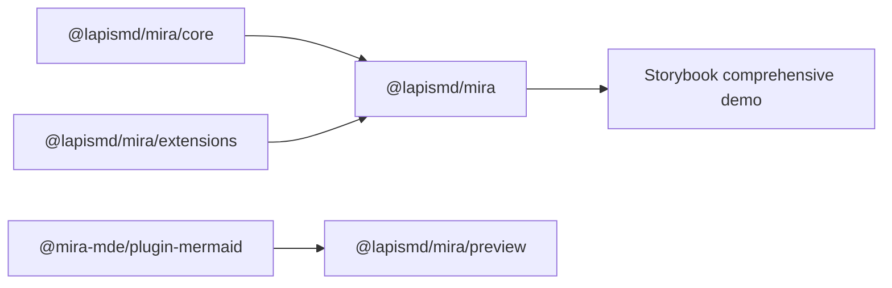
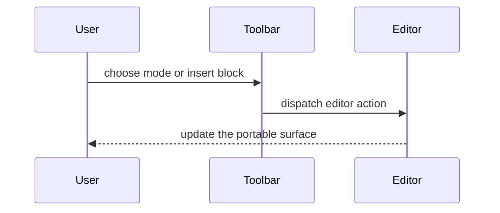

# Mira MDE comprehensive playground

This Storybook-owned fixture exercises the portable Markdown, editor, preview,
Mermaid, adapter, and default UI contracts against identical content in all four
supported views. It adapts the portable parts of Lapis's Markdown Feature Tour;
vault, workspace, registry, persistence, and application navigation behavior are
deliberately excluded.

For geometry-specific coverage, use the separate CodeMirror Layout Showcase.

## Headings and inline formatting

### Portable Markdown surface

Inline **bold**, _italic_, **_both_**, ~~strikethrough~~, `inline code`,
[relative links](notes/markdown.md), [external links](https://example.com),
automatic links such as https://example.com, [[Daily Note|wikilinks]], tags such
as #mira/editor, and inline math $E = mc^2$ render in preview and live preview.

---

> Plain blockquotes remain blockquotes and are not converted into callouts.
>
> > Nested blockquotes keep a second quote guide.

## Links, media, and embeds

Resolved path image:


Wikilink image embed with display text and sizing:

![[Architecture Diagram|320x180]]

Embedded note:

![[Embedded Note]]

Heading and block-reference embeds:

![[Embedded Note#Next Steps]]

![[Embedded Note#^portable-block]]

## Callouts

> [!note] Portable package boundary
> The editor, preview renderer, Mermaid support, and UI shell are separate
> workspace packages.

> [!warning]+ Expanded collapsible callout
> Collapsible callouts preserve title, icon, and fold state.

> [!tip]- Collapsed collapsible callout
> This content starts collapsed in rendered Markdown.

> [!note] Nested callout content
>
> - List item one
> - List item two

## Lists, tasks, and continuation

- Unordered parent with a wrapped continuation line that hangs beneath the text
  instead of the marker.
  Continued paragraph text stays aligned with the parent item.
  - Nested child with continuation text and indentation guides.
    Continued child text stays inside the nested level.
- & Highlighted list callout item
- ? Question list callout item
- ! Warning list callout item

1. Ordered parent with wrapped continuation text.
   Continued ordered text remains aligned with the ordered content.
2. Ordered parent with a nested task.
   - [ ] Nested task continuation stays aligned with its checkbox.

- [ ] Plain Markdown checklist item
- [x] Completed Markdown checklist item
- [/] In-progress marker
- [?] Question marker
- [!] Important marker
- [-] Cancelled marker
- [>] Forwarded marker
- [<] Scheduled marker
- ["] Quote marker
- [*] Star marker
- [l] Location marker
- [i] Info marker
- [S] Savings marker
- [I] Idea marker
- [f] Fire marker
- [k] Key marker
- [u] Up marker
- [d] Down marker
- [w] Win marker
- [p] Pro marker
- [c] Con marker
- [b] Bookmark marker

## Pipe and grid tables

| Package                    |  Surface   | Status |
| :------------------------- | :--------: | -----: |
| `@lapismd/mira/core`           | controller |  ready |
| `@lapismd/mira/preview`        |  reading   |  ready |
| `@mira-mde/plugin-mermaid` |  diagrams  |  ready |

MultiMarkdown spans:

| MultiMarkdown  | Span                    | Status |
| :------------- | :---------------------- | -----: |
| Combined cell  |                         |  ready |
| Persistent row | rendered Markdown       |  ready |
| ^              | source-compatible spans |  ready |

Grid table with headers, sections, row/column spans, and alignment:

+-------------------+------+
| Table Headings | Here |
+--------+----------+------+
| Sub | Headings | Too |
+========+=================+
| cell | column spanning |
| spans +---------:+------+
| rows | normal | cell |
+---v----+:---------------:+
| | cells can be |
| | _formatted_ |
| | **paragraphs** |
| | ~~~ |
| multi | and contain |
| line | blocks |
| cells | ~~~ |
+========+=========:+======+
| footer | cells | |
+--------+----------+------+

## Raw HTML and directives

<mark>Raw HTML is preserved</mark> and <kbd>keyboard</kbd> elements render
through the Markdown preview pipeline.

:::mira{title="Directive example"}
Directive syntax is parsed and surfaced as a portable custom element.
:::

## Mermaid

Flowchart:



Rough sequence:



## Code, math, and footnotes

```ts {2}
import { MiraDefaultMde } from "@mira-mde/default-ui/svelte";
import "@mira-mde/default-ui/styles.css";
```

Inline bracket math also remains authored as \(a^2 + b^2 = c^2\).

$$
\int_0^1 x^2 \, dx = \frac{1}{3}
$$

Footnotes share the GFM Markdown pipeline.[^feature-footnote]

[^feature-footnote]: This definition renders at the bottom in reading mode.

## Callout variant gallery

> [!note]

> [!abstract] Abstract, Summary, Tldr

> [!info] Info, Todo

> [!tip] Tip, Hint, Important

> [!success] Success, Check, Done

> [!question] Question, Help, FAQ

> [!warning] Warning, Caution, Attention

> [!failure] Failure, Fail, Missing

> [!danger] Danger, Error

> [!bug]

> [!example]

> [!quote] Quote, Cite
