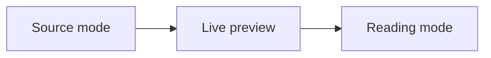

# CodeMirror Layout Showcase

This document is the Mira regression fixture for source, live-preview, reading,
and split modes. Stable phrase: showcase mode anchor.

Inline links and tags: [[notes/project|Project]], [raw space link](My Note.md),
#showcase/tag, and :badge[inline directive]{kind="sample"}.

Standalone embed:

![[notes/project]]

List callout marker:

- & Highlighted callout item should keep its marker and content aligned.

## Table Matrix

| Surface      | Mode         | Expected behavior                          |
| ------------ | ------------ | ------------------------------------------ |
| Source       | CodeMirror   | Raw pipes receive table line classes       |
| Live preview | Table widget | Interactive table widget replaces syntax   |
| Reading      | Rendered     | HTML table appears without raw pipe syntax |

+-------------------+-----------------------+-------------------------+
| Grid Heading | Inline Markdown | Wrapping Target |
+===================+=======================+=========================+
| Alpha cell | _emphasis_ and | This grid table cell |
| | **strong** text | has enough prose to |
| | | wrap inside the widget. |
+-------------------+-----------------------+-------------------------+
| Link cell | [[notes/project]] | `inline code` and |
| | | #grid/table-tag |
+-------------------+-----------------------+-------------------------+

## Block Quotes And Quoted Lists

> Stable phrase: quoted paragraph wrapping should hang under the quote prefix
> when the viewport is narrow enough to wrap this sentence across more than one
> visual row in CodeMirror.
>
> - Quoted unordered list item with a long body that should wrap under the item
>   text rather than under the quote marker.
>   - Nested quoted child item with inline `code` and #quoted/list-tag.
> - [ ] Quoted checklist item should keep checkbox and quote formatting spans.
>
> > Nested quote stable phrase: nested quote border should remain visible.

## List Indentation And Continuations

1. Ordered parent item with enough text to wrap across several visual rows so
   hanging indentation can be measured consistently.
   1. Ordered child item with space-authored depth and enough text to wrap
      inside a nested list item.
      - Mixed unordered child with stable phrase: nested unordered alignment.
2. Parent with continuation paragraphs:
   Continuation paragraph stable phrase: list continuation should align with
   the parent item text column after wrapping across multiple visual rows.

   Second continuation paragraph stays inside the ordered list item and should
   not collapse flush-left in live preview or reading mode.

- [ ] Checklist parent item with enough text to wrap and expose checkbox
      alignment in source and live preview.
  - Nested checklist child item with #task.
- Plain unordered parent
  - Tab-indented child item stable phrase: tab indentation should normalize.
    - Double-tab grandchild item keeps guide depth.

## Plain Indent Wrapping

    Four-space plain indented paragraph stable phrase: plain indent wrapping
    should keep continuation rows under the indented content column rather than
    snapping to the page edge.

Two-space plain indented paragraph stable phrase: two space indent wrapping
should still receive measured indentation.

## Explicit Text Fence

```text
source --> live-preview --> preview --> split --> source; this intentionally long text line remains on one horizontal source row
```

## Code Math Mermaid And Directives

Inline math: $a^2 + b^2 = c^2$.

$$
\sum_{n=1}^{4} n = 10
$$

```ts
type Showcase = {
  mode: "source" | "live-preview" | "preview" | "split";
  stable: boolean;
};
```



::note[Leaf directive fixture]{kind="layout"}
